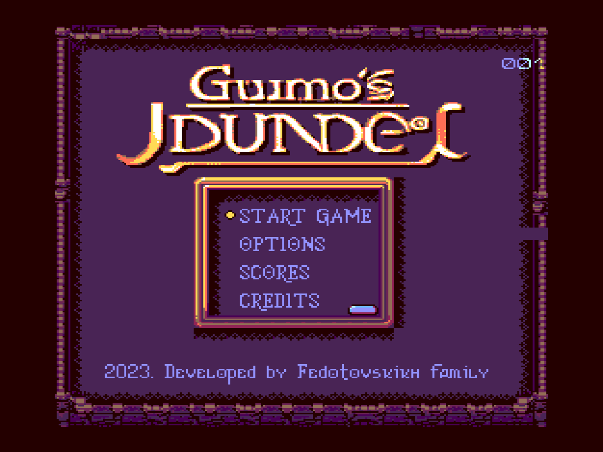
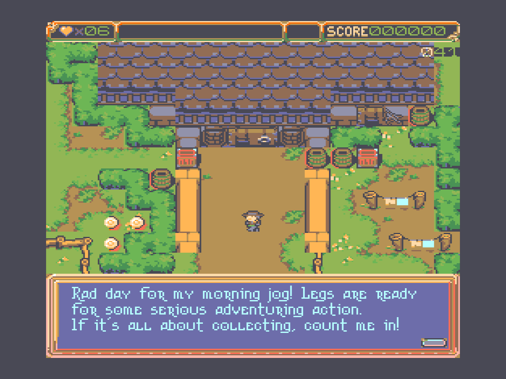
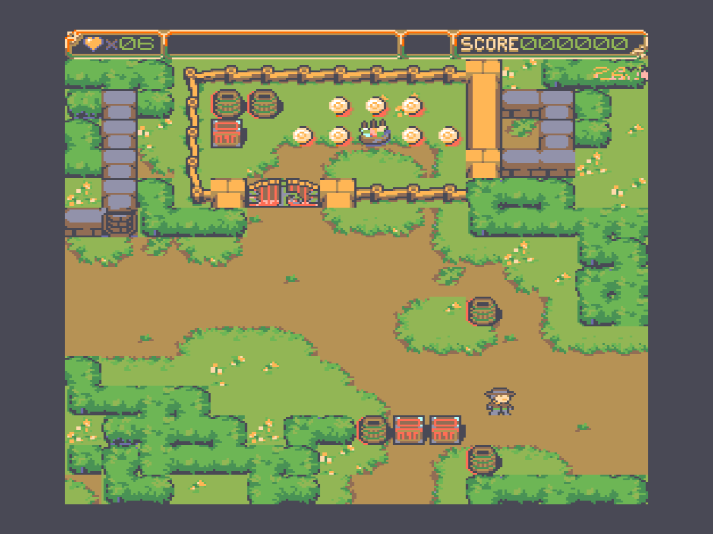
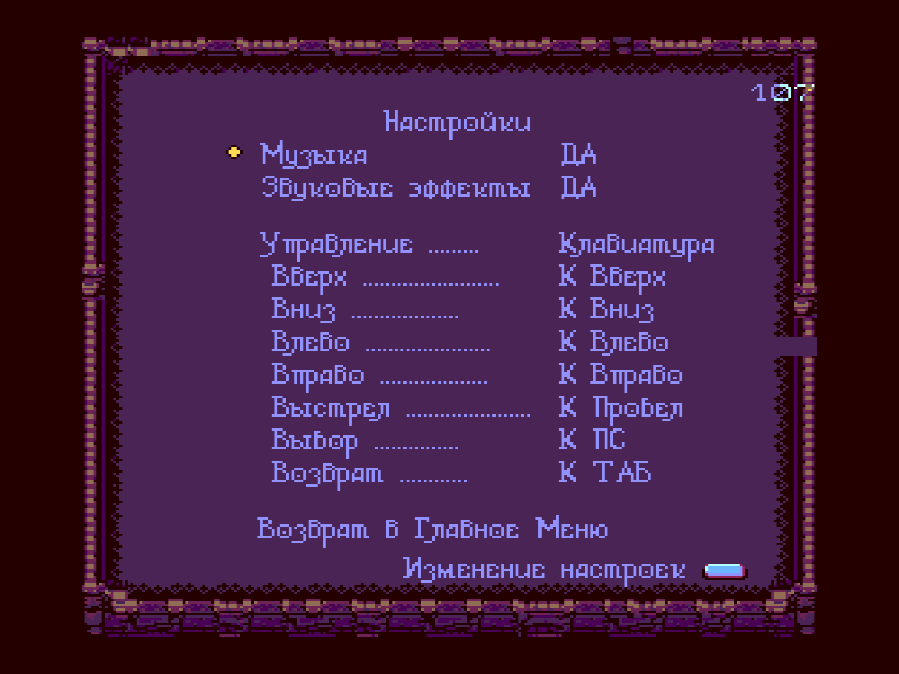
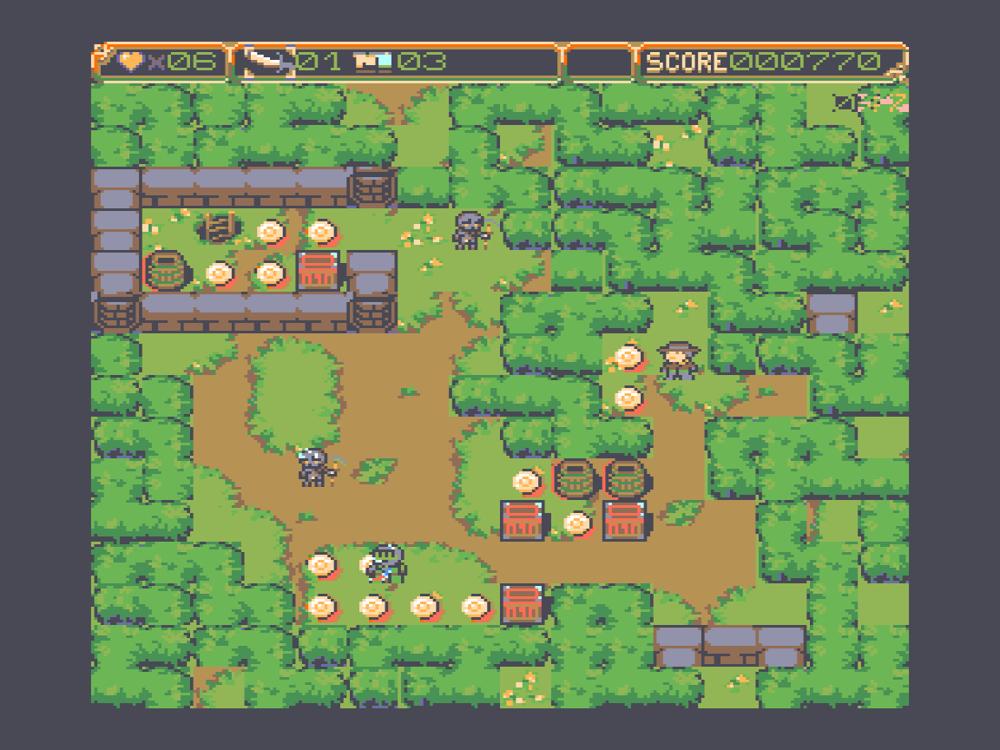
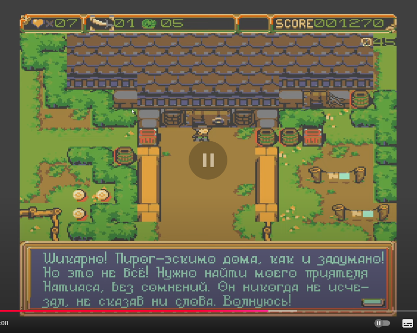

# Guimos Jdundel

### Table of Contents
1. [Description](#description)
2. [Screenshots](#screenshots)
3. [Play](#play)
4. [Build](#build)
5. [Documentation](#documentation)
   1. [Prehistory](#prehistory)
   2. [Intro](#intro)
   3. [Debug Mode](#debug-mode)
   4. [Folder Structure](#folder-structure)
   5. [Troubleshooting](#troubleshooting)
   6. [Naming Conventions](#naming-conventions)
      1. [Prefixes](#prefixes)

## 📝 Description

Oh, no! Your best buddy is GONE! No chill, no waiting — kickstart the daring 
rescue mission right now. Who’s gonna save the day? You are, the hero!

### Featuring:
* *Monster! Monsters! Monster!*  
   * *Treasure! Treasure! Treasure!*
      * *Quirky humor, yummy pies!*
         * *and, of course, a bit of shiny coins!*


Grab your legendary spoon, buckle up, and get ready for a frosty, wacky ride!
The journey’s gonna be wild!😊

## Screenshots
<p>






</p>

## Video 
[](https://www.youtube.com/watch?v=WMzj-VmqIDg)

## 🕹️ Play
* Run `game.bat` to start the game.

## 🔨 Build
* 🛠️ Install `Retroassembler` from https://enginedesigns.net/
* 📥 Clone [`fddutil_python`](https://github.com/parallelno/fddutil_python.git) into `\scripts` folder
* ▶️ `F5` or `Ctrl+F5` to build & Run

## 📄 Documentation

### Prehistory
This game was built for the [`Soviet Retro PC Vector 06c`](https://en.wikipedia.org/wiki/Vector-06C), which was my first computer. It inspired me and set me on an endless journey into the game development industry. Sweet dreams, old friend. I'll remember you forever!

Creating this game was a massive effort on my part. The lack of documentation, a small community of enthusiasts, and my inexperienced hands made the process complex and slow. Just the demo alone took me two years to complete. But I regret no second! It was a fun learning project! During this time, I learned a great deal about the architecture of this little boy. I'm still amazed by how incredibly clever the engineers and architects of that era were who built up the concrete of the current tech era—the fathers of Intel. 
After releasing the demo, I spent another year just to build my own emulator with advanced debugging capabilities, which I believe can significantly speed up the development process and help me finish the final product. Fingers crossed!

### Intro
The project is divided into two parts: the sprite engine, called V6, and the game built with it as a demonstration of the engine's capabilities. The goal was to reuse the game logic and utilities as simply as possible while exploring and documenting the features of the Vector 06c wherever they existed. This includes the fastest sprite rendering, advanced font techniques, AY music, multichannel sound effects, the RAM disk, FDD, I/O OS support, all enhanced with an intuitive yet powerful build system.

### Debug Mode
* To enable debug mode, uncomment the line `v6_debug_mode == DEBUG_ON` in the `v6_debug.asm`

### 📁 Folder Structure
```plaintext
.vscode
└── [configuration files]
assets
    ├── basefdd/    # Contains FDD images with bootable OS used to store game assets
    │               # rds308.fdd is the most preferable
    ├── fdd_files/  # Required files
    └── [other assets]
```
### ❗ Troubleshooting
* F5 Not Building Project After Retroassembler Installation
   * Solution:
      * Open VS Code Keyboard Shortcuts (Ctrl+K, Ctrl+S)
      * Search for "Start Debugging"
      * Delete Retroassembler F5 bindings

### 📚 Naming Conventions
#### Prefixes:

* ADDR - Address
* BUF - Buffer
* INT - Interruption
* SCR - Screen buffer
* MEM - Memory
* LEN - Length
* SEC - Second
* SEG - Segment (half of a 64K bank of the ram-disk)
* RES - Result
* PTR - Pointer
