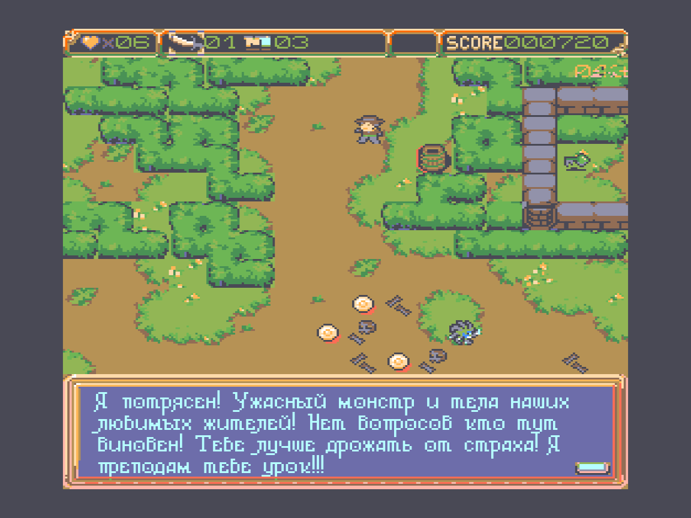

# Guimos Jdundel

### Table of Contents
1. [Description](#description)
2. [Screenshots](#screenshots)
3. [Play](#play)
4. [Build](#build)
5. [Documentation](#documentation)
   1. [Prehistory](#prehistory)
   2. [Intro](#intro)
   3. [Debug Mode](#debug-mode)
   4. [Folder Structure](#folder-structure)
   5. [Troubleshooting](#troubleshooting)
   6. [Naming Conventions](#naming-conventions)
      1. [Prefixes](#prefixes)

## 📝 Description

Oh, no! Your best buddy is GONE! No chill, no waiting — kickstart the daring
rescue mission right now. Who’s gonna save the day? You are, the hero!

### Featuring:
* Monsters! Monsters!
* Treasure chests!
* Quirky humor, yummy quests!


Grab your legendary spoon, buckle up, and get ready for a frosty, wacky ride!
The journey’s gonna be wild!😊

## Screenshots
<p>




</p>


## Video
[](https://www.youtube.com/watch?v=WMzj-VmqIDg)

## 🕹️ Play
* Run `game.bat` to start the game.

## 🔨 Build
* 🛠️ Install `Retroassembler` from https://enginedesigns.net/
* ▶️ `F5` or `Ctrl+F5` to build & Run

## 📄 Documentation

### Prehistory
This game was built for the Soviet retro PC [`Vector 06c`](https://en.wikipedia.org/wiki/Vector-06C), which was my first computer. It inspired me and set me on an endless journey into the game development industry. Sweet dreams, old friend. I'll remember you forever!

Creating this game was a tremendous effort. It started as a benchmark and then evolved into a game project. The lack of documentation, a small community of enthusiasts, and my twisted hands made the process complex and slow. Just the demo alone took me two years to complete. But I regret no second! It was a fun learning project! During this time, I learned a great deal about computer low-level architecture, practiced various programming languages like Assembly, Python, C++, and C#, built systems like Cmake, made one mine in Python, tried tons of different UI frameworks like Winforms, WPF, UWP, Dart, ImGui, databases, finally learned and integrated cross-platform development and testing.

During the demo development, I suffered from the rudimentary debugging tools available around for this computer. I spent several months adding debugging to [`v06x`](https://github.com/svofski/vector06sdl) the emulator I used back then.

After releasing the demo, I concluded I needed more robust tooling and spent another year building my own emulator [`Devector`](https://github.com/parallelno/Devector). It has advanced debugging features and must significantly speed up my development process and help me finish the final product. Fingers crossed!

### Intro
This project is divided into two key components: the game and the sprite engine, called V6. The engine's goal is to make life easier for retro gaming enthusiasts. Key features include:

* Ultra-fast sprite rendering.
* 8 color sprites with mask support.
* 16 color background.
* 16x15 tile field with 16x16 pixel tiles.
* Animated decals.
* Non-animated decal tiles.
* Efficient sprite sorting by Y.
* Top layer for projectiles (bullets).
* Non monospaced font support.
* Floppy disk data loading via I/O syscalls.
* AY music and multichannel sound effects.
* Up to 8 RAM disks support.
* A powerful yet intuitive build system to simplify workflows.

I hope it inspires more devs to dive into the retrocomputing world.

### 📁 Folder Structure
```plaintext
.vscode
└── [configuration files]
asm
    ├── app    # game code
    └── v6     # game engine code
assets
    ├── backs       # Animated decals
    ├── basefdd/    # Contains rds308.fdd bootable OS image to build the final game FDD image.
    ├── decals      # Non-animated tiles
    ├── design      # Design documents
    ├── fonts       # Non-monospaced fonts (rus/eng/etc.)
    ├── levels      # Level graphics, level data in a Tiled format
    ├── music       # Music meta data and a source in YM format
    ├── palletes    # Color pallets and the fade transitions
    ├── sprites     # Sprite graphics and meta data (animations, preshifting info)
    ├── text        # Dialog tests
    ├── tiled_imgs  # Tiled image graphics and meta data
    └── config.json # Configuration build file
```
### ❗ Troubleshooting
* F5 Not Building Project After Retroassembler Installation
   * Solution:
      * Open VS Code Keyboard Shortcuts (Ctrl+K, Ctrl+S)
      * Search for "Start Debugging"
      * Delete Retroassembler F5 bindings

### 📚 Naming Conventions
#### Prefixes:

* ADDR - Address
* BUF - Buffer
* INT - Interruption
* SCR - Screen buffer
* MEM - Memory
* LEN - Length
* SEC - Second
* SEG - Segment (half of a 64K bank of the RAM Disk)
* RES - Result
* PTR - Pointer
